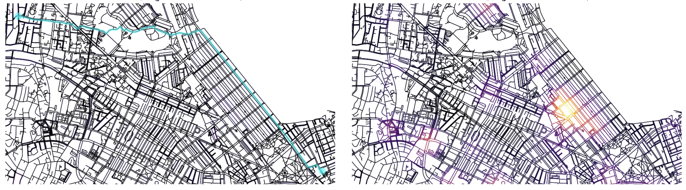

# Overview
This project builds an informed navigation system that accounts for safety risks. To demonstrate the algorithm’s use case, we focused our project on the city of Boston.

# Sample Outputs


# Project Dependencies
```bash
# Install via pip
pip install uv
# Install via pipx
pipx install uv
```

## Adding project dependencies
```bash
uv add <project-dependencies>
```

## Installing project dependencies
```bash
uv sync
```

Afterwards, source the virtual environment
```bash
source ./venv/bin/activate
```

## Running the data creation pipeline
```bash
make run_data_pipeline
```

## Running the geocoding and graph pipeline
```bash
make run_graph_pipeline
```

Starting and ending destinations can be changed as they are fixed constants in `graph/main.py`
```python
STARTING_DEST = "24 Beacon St, Boston, MA 02133"
ENDING_DEST = "82 Hillside St, Boston, MA 02120"
TIME_OF_DAY = 14  # The time of day in hours (military time)
``` 
The result of the _graph pipeline_ will be the optimal walkable path predicted by our model based off the Boston police
department dataset.

## Document Overview
Our repository contains both the core scripts used in the final pipeline and several earlier experiments that we kept for reference.<br>
The files that actually support the final system are:<br>

- data/crime_data.py: preprocess the original crime dataset (assign risk score and seperate by time intervals) and create `aggregated_crimes.csv`.
- geocoding/geocoding.py: include functions for geocoding. 
- graph/create_graph.py: include functions that download the Boston walk graph, create KDE surface, assign risk scores to edges,
and convert coordinates from CRS to WGS84.
- graph/visualize_graph.py: include functions to create visualizations.
- graph/main.py: main file to run the system
- graph/evaluate_routes.py: run the evaluation for multiple starting and ending route pairs.

Other files in the repo come from earlier attempts or exploratory work.
We chose to keep them because they document our process, but they are not part of the final workflow.

## Future Enhancements
- Assigning larger, more nuanced scores to violent crimes as opposed to non-violent crimes. Enabling more clarity on the
  actual safety and security of a specific walkable path/street.
- Utilize street-level image data to also factor into the safety score of a street, in particular how well lit it is,
  how crowded is it, and traffic conditions at particular times of the day.
